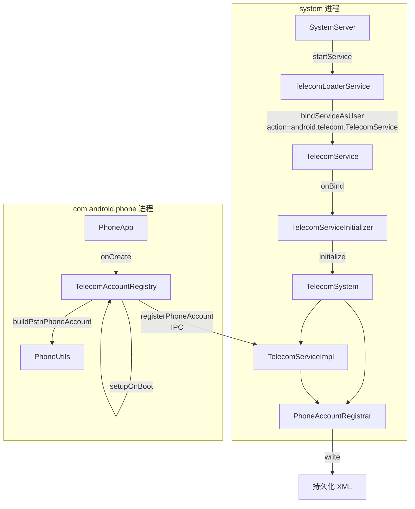
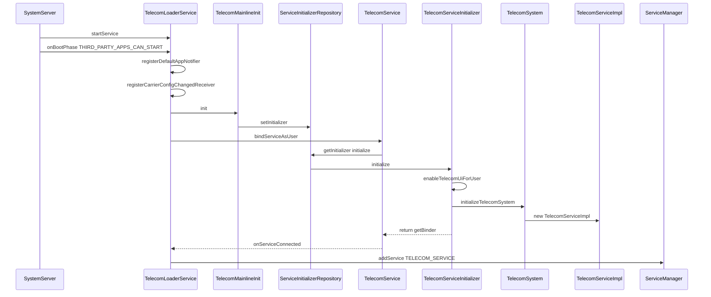
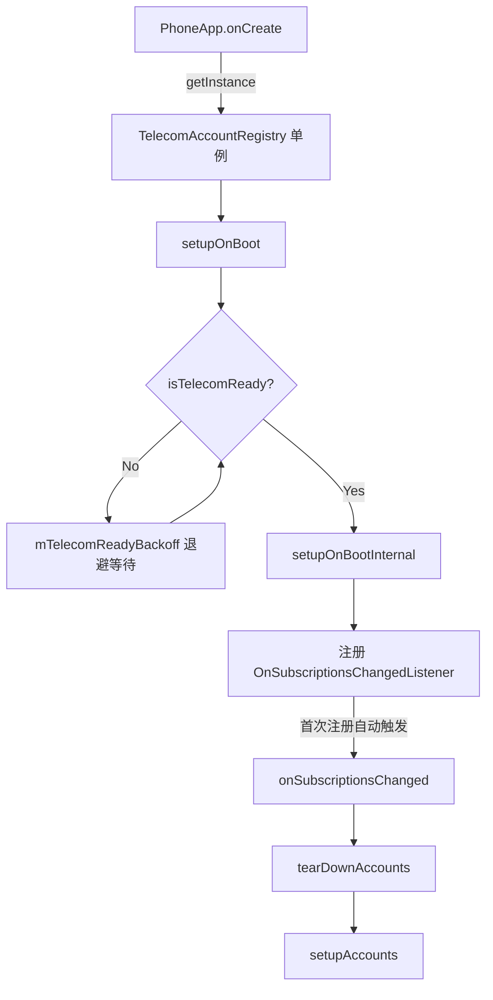
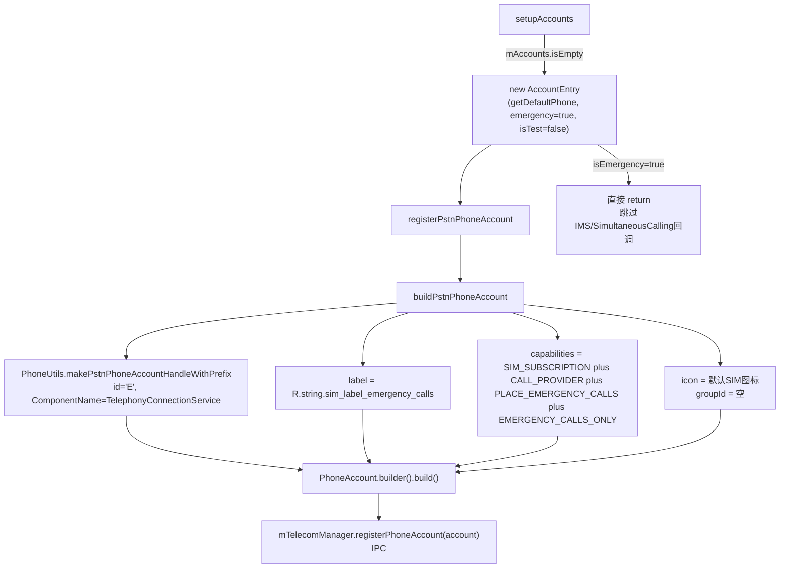

## 1 概述

当 Android 设备首次开机且未插入 SIM 卡时，系统需要确保用户仍然能够拨打紧急呼叫号码（如 112、911）。为此，Telephony 框架会自动创建一个仅限紧急通话的默认 PhoneAccount，注册到 Telecom 框架中。

本文档完整追踪这一过程：从系统启动时 `TelecomLoaderService` 绑定 `TelecomService`，到 Telecom 核心系统初始化完成，再到 Telephony 侧 `TelecomAccountRegistry` 检测到无 SIM 卡后创建紧急通话 `PhoneAccount`，最终通过 `TelecomManager.registerPhoneAccount()` 将其注册到 `PhoneAccountRegistrar` 并持久化。

适用场景：首次开机无 SIM 卡、恢复出厂设置后首次启动、设备无有效 SIM 订阅。

## 2 系统架构概览

整个流程涉及两个进程中的多个组件协同工作。system 进程负责 Telecom 框架的启动和 PhoneAccount 的注册管理，com.android.phone 进程负责 Telephony 侧的账户发现和构建。



| 组件 | 进程 | 职责 |
|------|------|------|
| SystemServer | system | 启动 TelecomLoaderService |
| TelecomLoaderService | system | 绑定 TelecomService 并将其注册到 ServiceManager |
| TelecomService | system | Service 入口，onBind 返回初始化后的 Binder |
| TelecomServiceInitializer | system | 真正的初始化器，创建 TelecomSystem |
| TelecomSystem | system | Telecom 核心，管理 CallsManager 和 PhoneAccountRegistrar |
| TelecomServiceImpl | system | ITelecomService 实现，对外提供 PhoneAccount 注册接口 |
| PhoneAccountRegistrar | system | PhoneAccount 的校验、存储和持久化 |
| PhoneApp | phone | 电话应用入口 |
| TelecomAccountRegistry | phone | 管理 Telephony 侧的 PhoneAccount 注册和更新 |
| PhoneUtils | phone | 构建 PhoneAccountHandle |

## 3 TelecomService 系统服务启动

### 3.1 TelecomLoaderService 创建

系统启动过程中，`SystemServer.startOtherServices()` 负责启动 `TelecomLoaderService`：

```java
// SystemServer.java - startOtherServices()
if (mPackageManager.hasSystemFeature(PackageManager.FEATURE_MICROPHONE)
        || mPackageManager.hasSystemFeature(PackageManager.FEATURE_TELECOM)
        || mPackageManager.hasSystemFeature(PackageManager.FEATURE_TELEPHONY)) {
    t.traceBegin("StartTelecomLoaderService");
    mSystemServiceManager.startService(TelecomLoaderService.class);
    t.traceEnd();
}
```

启动条件为设备具备麦克风、Telecom 或 Telephony 任意一个系统特性。`TelecomLoaderService` 继承自 `SystemService`，构造函数中完成三项初始化：

```java
// TelecomLoaderService.java - 构造函数
public TelecomLoaderService(Context context) {
    super(context);
    mContext = context;
    registerDefaultAppProviders();    // 注册 SMS/Dialer/SimCallManager 默认应用提供者
    mAppOpsManager = mContext.getSystemService(AppOpsManager.class);
    mToken = new Binder();
    IntentFilter userAddedFilter = new IntentFilter(Intent.ACTION_USER_ADDED);
    userAddedFilter.setPriority(IntentFilter.SYSTEM_HIGH_PRIORITY);
    mContext.registerReceiver(mUserAddedReceiver, userAddedFilter);
}
```

`registerDefaultAppProviders()` 通过 `LegacyPermissionManagerInternal` 注册三个回调提供者，分别为权限管理器提供默认 SMS 应用、默认拨号器和默认 SimCallManager 的包名信息。

`onStart()` 为空实现，真正的绑定操作发生在 `onBootPhase` 回调中。

### 3.2 绑定 TelecomService

当系统启动进入 `PHASE_THIRD_PARTY_APPS_CAN_START` 阶段时，`TelecomLoaderService.onBootPhase()` 被触发：

```java
// TelecomLoaderService.java
@Override
public void onBootPhase(int phase) {
    if (phase == PHASE_THIRD_PARTY_APPS_CAN_START) {
        registerDefaultAppNotifier();
        registerCarrierConfigChangedReceiver();
        connectToTelecom();
    }
}
```

`connectToTelecom()` 是实际绑定逻辑的核心：

```java
// TelecomLoaderService.java
private void connectToTelecom() {
    synchronized (mLock) {
        if (mServiceConnection != null) {
            mContext.unbindService(mServiceConnection);
            mServiceConnection = null;
        }

        LoaderServiceConnection serviceConnection = new LoaderServiceConnection();
        Intent intent = new Intent(SERVICE_ACTION);   // "android.telecom.TelecomService"
        intent.setPackage(PACKAGE_NAME);               // "com.android.server.telecom"
        int flags = Context.BIND_IMPORTANT | Context.BIND_FOREGROUND_SERVICE
                | Context.BIND_AUTO_CREATE;

        TelecomMainlineInit.init(mContext);  // 注入 TelecomServiceInitializer
        Slog.i(TAG, "Binding to TelecomService...");
        if (mContext.bindServiceAsUser(intent, serviceConnection, flags, UserHandle.SYSTEM)) {
            Slog.i(TAG, "Bound to TelecomService!");
            mServiceConnection = serviceConnection;
        }
    }
}
```

绑定前先调用 `TelecomMainlineInit.init()`，将 `TelecomServiceInitializer` 实例注入到 `TelecomServiceInitializerRepository` 中：

```java
// TelecomLoaderService.java - 内部类
private static class TelecomMainlineInit {
    static void init(Context context) {
        PackageManagerInternal packageManagerInternal =
                LocalServices.getService(PackageManagerInternal.class);
        var initializer = new android.telecom.service.TelecomServiceInitializer(
                packageManagerInternal.getSystemUiServiceComponent().getPackageName());
        android.telecom.TelecomServiceInitializerRepository.setInitializer(initializer);
    }
}
```

TelecomService 在 `AndroidManifest.xml` 中声明为运行在 system 进程：

```xml
<!-- Telecomm/AndroidManifest.xml -->
<service android:name=".components.TelecomService"
     android:singleUser="true"
     android:process="system"
     android:exported="true">
    <intent-filter>
        <action android:name="android.telecom.TelecomService"/>
    </intent-filter>
</service>
```

由于 `android:process="system"`，TelecomService 实际运行在 system_server 进程内，绑定操作不会发生跨进程调用。

### 3.3 TelecomService.onBind 与 TelecomServiceInitializer

`TelecomService` 本身是一个极简的 shim（垫片）类，`onBind` 将初始化委托给 `TelecomServiceInitializerRepository`：

```java
// TelecomService.java
public class TelecomService extends Service {
    @Override
    public IBinder onBind(Intent intent) {
        Log.i(TAG, "onBind");
        if (TelecomServiceInitializerRepository.getInitializer() != null) {
            return TelecomServiceInitializerRepository.getInitializer().initialize(this);
        } else {
            Log.wtf(TAG, "no telecom library loaded!");
        }
        return null;
    }
}
```

`TelecomServiceInitializer.initialize()` 完成三项工作后返回 TelecomServiceImpl 的 Binder：

```java
// TelecomServiceInitializer.java
@Override
public @Nullable IBinder initialize(@NonNull Context context) {
    final String telecomUiPackage = getTelecomUiPackageName(context);
    // 1. 为所有用户启用 TelecomUi 包
    UserManager userManager = context.getSystemService(UserManager.class);
    for (UserHandle userHandle : userManager.getUserHandles(true)) {
        enableTelecomUiForUser(context, userHandle, telecomUiPackage);
    }
    // 2. 注册用户添加广播
    context.registerReceiver(userAddedReceiver, filter, Context.RECEIVER_NOT_EXPORTED);
    // 3. 核心：初始化 TelecomSystem 单例
    initializeTelecomSystem(context, mSysUiPackage, telecomUiPackage);
    // 4. 返回 TelecomServiceImpl 的 Binder
    synchronized (getTelecomSystem().getLock()) {
        getTelecomSystem().getTelecomServiceImpl().setInitPath("mainline");
        return getTelecomSystem().getTelecomServiceImpl().getBinder();
    }
}
```

`initializeTelecomSystem()` 创建 `TelecomSystem` 单例，其构造函数中依次创建 `PhoneAccountRegistrar`、`CallsManager`、`CallIntentProcessor`，最终创建 `TelecomServiceImpl` 并持有其引用。

### 3.4 LoaderServiceConnection -- 注册到 ServiceManager

绑定成功后 `onServiceConnected` 回调被触发，将获得的 Binder 注册到 `ServiceManager`：

```java
// TelecomLoaderService.java - 内部类
public void onServiceConnected(ComponentName name, IBinder service) {
    SmsApplication.getDefaultMmsApplication(mContext, false);
    ServiceManager.addService(Context.TELECOM_SERVICE, service);

    synchronized (mLock) {
        // 处理待处理的 SimCallManager 权限请求
        // 限制麦克风/相机 AppOps
        restrictPhoneCallOps();
    }
}
```

至此，`Context.TELECOM_SERVICE` 在 `ServiceManager` 中可用。后续应用通过 `Context.getSystemService(Context.TELECOM_SERVICE)` 获取 `TelecomManager` 实例时，`SystemServiceRegistry` 中的 `CachedServiceFetcher` 从 `ServiceManager` 获取该 Binder 并封装返回。



## 4 TelecomAccountRegistry 初始化

### 4.1 PhoneApp.onCreate 入口

Telecom 服务就绪后，电话应用（com.android.phone）启动时触发初始化。入口在 `PhoneApp.onCreate()`：

```java
// PhoneApp.java
public class PhoneApp extends Application {
    @Override
    public void onCreate() {
        if (UserHandle.myUserId() == 0) {
            mPhoneGlobals = new PhoneGlobals(this);
            mPhoneGlobals.onCreate();

            TelecomAccountRegistry telecomAccountRegistry =
                    TelecomAccountRegistry.getInstance(this);
            if (telecomAccountRegistry != null) {
                telecomAccountRegistry.setupOnBoot();
            }
        }
    }
}
```

仅主用户（userId == 0）执行初始化。`TelecomAccountRegistry.getInstance()` 创建单例实例。

### 4.2 setupOnBoot 等待 Telecom 就绪

由于 PhoneApp 启动时 Telecom 可能尚未完成绑定，`setupOnBoot()` 内置了退避等待机制：

```java
// TelecomAccountRegistry.java - 第 1782 行
public void setupOnBoot() {
    if (!isTelecomReady()) {
        Log.i(this, "setupOnBoot: delaying start for Telecom...");
        mTelecomReadyBackoff.start();
    } else {
        if (Flags.initializeTelecomAccountRegistryAsync()) {
            mHandler.post(() -> setupOnBootInternal());
        } else {
            setupOnBootInternal();
        }
    }
}
```

`isTelecomReady()` 通过调用 `mTelecomManager.getSystemDialerPackage()` 判断 Telecom 是否已就绪。返回 null 或抛出异常均表示未就绪。退避机制使用 `mTelecomReadyBackoff`（指数退避定时器）反复重试，直到 Telecom 服务可用后进入 `setupOnBootInternal()`。

### 4.3 setupOnBootInternal 注册监听器

`setupOnBootInternal()` 注册多个监听器来响应订阅、状态和配置变化：

```java
// TelecomAccountRegistry.java - 第 1800 行
private void setupOnBootInternal() {
    // 1. 注册订阅变化监听器（首次注册保证触发回调）
    SubscriptionManager.from(mContext).addOnSubscriptionsChangedListener(
            mOnSubscriptionsChangedListener);

    // 2. 注册 ServiceState 变化回调
    mTelephonyManager.registerTelephonyCallback(
            TelephonyManager.INCLUDE_LOCATION_DATA_NONE,
            new HandlerExecutor(mHandler), mTelephonyCallback);

    // 3. 注册用户切换和运营商配置变化广播
    IntentFilter filter = new IntentFilter();
    filter.addAction(Intent.ACTION_USER_SWITCHED);
    filter.addAction(CarrierConfigManager.ACTION_CARRIER_CONFIG_CHANGED);
    mContext.registerReceiver(mReceiver, filter);

    // 4. 注册语言区域变化广播
    IntentFilter localeChangeFilter = new IntentFilter(Intent.ACTION_LOCALE_CHANGED);
    mContext.registerReceiver(mLocaleChangeReceiver, localeChangeFilter);

    registerContentObservers();
}
```

`addOnSubscriptionsChangedListener` 的首次注册会自动触发 `onSubscriptionsChanged()` 回调，这是触发账户创建的关键入口。

### 4.4 onSubscriptionsChanged 回调

```java
// TelecomAccountRegistry.java - 第 1250 行
private OnSubscriptionsChangedListener mOnSubscriptionsChangedListener =
        new OnSubscriptionsChangedListener() {
    @Override
    public void onSubscriptionsChanged() {
        mSubscriptionListenerState = LISTENER_STATE_REGISTERED;
        Log.i(this, "onSubscriptionsChanged - update accounts");
        if (Flags.rebuildTelecomAccountsAsync()) {
            mHandler.post(() -> {
                tearDownAccounts();
                setupAccounts();
            });
        } else {
            tearDownAccounts();
            setupAccounts();
        }
    }
};
```

每次订阅变化时，先 `tearDownAccounts()` 清理旧的 `AccountEntry` 列表，再调用 `setupAccounts()` 重新构建。



## 5 紧急通话 PhoneAccount 的构建

### 5.1 setupAccounts 无 SIM 分支

`setupAccounts()` 遍历所有 Phone 对象，尝试为每个有效 SIM 创建 `AccountEntry`。当设备无 SIM 卡时，所有 Phone 的 subscriptionId 无效，`mAccounts` 列表为空：

```java
// TelecomAccountRegistry.java - 第 1922 行
private void setupAccounts() {
    Phone[] phones = PhoneFactory.getPhones();
    Log.i(this, "setupAccounts: Found %d phones.", phones.length);

    final boolean phoneAccountsEnabled = mContext.getResources().getBoolean(
            R.bool.config_pstn_phone_accounts_enabled);

    synchronized (mAccountsLock) {
        try {
            if (phoneAccountsEnabled) {
                for (Phone phone : phones) {
                    int subscriptionId = phone.getSubId();
                    if (shouldSkipAccountEntry(subscriptionId)) {
                        continue;
                    }
                    mAccounts.add(new AccountEntry(phone,
                            false /* emergency */, false /* isTest */));
                }
            }
        } finally {
            // 关键分支：没有注册任何账户时，创建默认紧急通话账户
            if (mAccounts.isEmpty()) {
                Log.i(this, "setupAccounts: adding default");
                mAccounts.add(
                    new AccountEntry(PhoneFactory.getDefaultPhone(),
                            true /* emergency */, false /* isTest */));
            }
            // ... reconcile default voice sub ...
        }
    }
    cleanupPhoneAccounts();
}
```

`shouldSkipAccountEntry(subscriptionId)` 在 subscriptionId 为 `SubscriptionManager.INVALID_SUBSCRIPTION_ID` 时返回 true，导致所有 Phone 都被跳过，最终进入 `mAccounts.isEmpty()` 分支，使用 `PhoneFactory.getDefaultPhone()` 创建 emergency AccountEntry。

### 5.2 AccountEntry 构造与紧急模式特殊处理

`AccountEntry` 构造函数中完成注册，但紧急账户有特殊处理：

```java
// TelecomAccountRegistry.java - 第 170 行
AccountEntry(Phone phone, boolean isEmergency, boolean isTest) {
    mPhone = phone;
    mIsEmergency = isEmergency;
    mIsTestAccount = isTest;
    mIsAdhocConfCapable = mPhone.isImsRegistered();
    mSCT = SimultaneousCallingTracker.getInstance();
    mSimultaneousCallSupportedSubIds =
            mSCT.getSubIdsSupportingSimultaneousCalling(mPhone.getSubId());
    mAccount = registerPstnPhoneAccount(isEmergency, isTest);
    Log.i(this, "Registered phoneAccount: %s with handle: %s",
            mAccount, mAccount.getAccountHandle());
    mIncomingCallNotifier = new PstnIncomingCallNotifier((Phone) mPhone);
    mPhoneCapabilitiesNotifier = new PstnPhoneCapabilitiesNotifier((Phone) mPhone, this);

    // 紧急和测试账户跳过 IMS 能力监听
    if (mIsTestAccount || isEmergency) {
        return;
    }
    // 常规账户继续注册 IMS、SimultaneousCalling 等回调 ...
}
```

`isEmergency=true` 时直接 return，不注册 IMS 能力变化监听、不注册 SimultaneousCalling 回调，因为这些回调依赖有效的 SIM 订阅。

### 5.3 buildPstnPhoneAccount 构建过程

`buildPstnPhoneAccount(true, false)` 的完整构建逻辑如下：

```java
// TelecomAccountRegistry.java - 第 345 行
private PhoneAccount buildPstnPhoneAccount(boolean isEmergency, boolean isTestAccount) {
    String testPrefix = isTestAccount ? "Test " : "";
    UserHandle userToRegister = mPhone.getUserHandle();

    // 构建 PhoneAccountHandle
    PhoneAccountHandle phoneAccountHandle =
            PhoneUtils.makePstnPhoneAccountHandleWithPrefix(
                    mPhone, testPrefix, isEmergency, userToRegister);
    // ...
```

**PhoneAccountHandle 构建**在 `PhoneUtils` 中完成：

```java
// PhoneUtils.java
public static final String EMERGENCY_ACCOUNT_HANDLE_ID = "E";

public static PhoneAccountHandle makePstnPhoneAccountHandleWithPrefix(
        Phone phone, String prefix, boolean isEmergency, UserHandle userHandle) {
    String id = isEmergency ? EMERGENCY_ACCOUNT_HANDLE_ID : prefix +
            String.valueOf(phone.getSubId());
    return makePstnPhoneAccountHandleWithId(id, userHandle);
}

// 固定的 ComponentName
private static final ComponentName PSTN_CONNECTION_SERVICE_COMPONENT =
        new ComponentName("com.android.phone",
                "com.android.services.telephony.TelephonyConnectionService");
```

当 `isEmergency=true` 时，id 固定为 `"E"`，ComponentName 固定指向 `TelephonyConnectionService`。

**label 和 description 设置**：

```java
// TelecomAccountRegistry.java - 第 382 行
if (isEmergency) {
    label = mContext.getResources().getString(R.string.sim_label_emergency_calls);
    description = mContext.getResources().getString(
            R.string.sim_description_emergency_calls);
}
```

**capabilities 构建**：

```java
// 基础能力
int capabilities = PhoneAccount.CAPABILITY_SIM_SUBSCRIPTION |
        PhoneAccount.CAPABILITY_CALL_PROVIDER;

// 紧急呼叫能力（默认开启）
if (mContext.getResources().getBoolean(R.bool.config_pstnCanPlaceEmergencyCalls)) {
    capabilities |= PhoneAccount.CAPABILITY_PLACE_EMERGENCY_CALLS;
}

// 紧急账户专用：标记为仅限紧急通话
if (isEmergency && mContext.getResources().getBoolean(
        R.bool.config_emergency_account_emergency_calls_only)) {
    capabilities |= PhoneAccount.CAPABILITY_EMERGENCY_CALLS_ONLY;
}
```

**最终 PhoneAccount 构建**：

```java
// TelecomAccountRegistry.java - 第 584 行
PhoneAccount.Builder accountBuilder = PhoneAccount.builder(phoneAccountHandle, label)
        .setAddress(Uri.fromParts(PhoneAccount.SCHEME_TEL, line1Number, null))
        .setSubscriptionAddress(
                Uri.fromParts(PhoneAccount.SCHEME_TEL, subNumber, null))
        .setCapabilities(capabilities)
        .setIcon(icon)
        .setHighlightColor(PhoneAccount.NO_HIGHLIGHT_COLOR)
        .setShortDescription(description)
        .setSupportedUriSchemes(Arrays.asList(
                PhoneAccount.SCHEME_TEL, PhoneAccount.SCHEME_VOICEMAIL))
        .setExtras(extras)
        .setGroupId(groupId);
```

当 icon 为 null 时，使用默认 SIM 图标（`DEFAULT_SIM_ICON` 资源 + `default_sim_icon_tint_color` 着色）。紧急账户的 groupId 为空字符串。

### 5.4 registerPstnPhoneAccount 发起注册

```java
// TelecomAccountRegistry.java - 第 324 行
private PhoneAccount registerPstnPhoneAccount(boolean isEmergency, boolean isTestAccount) {
    PhoneAccount account = buildPstnPhoneAccount(mIsEmergency, mIsTestAccount);
    try {
        mTelecomManager.registerPhoneAccount(account);
    } catch (SecurityException se) {
        AnomalyReporter.reportAnomaly(...);
        throw se;
    }
    return account;
}
```

`mTelecomManager.registerPhoneAccount(account)` 通过 IPC 调用 TelecomServiceImpl 的注册接口。



## 6 PhoneAccount 注册与持久化

### 6.1 TelecomServiceImpl 权限检查

`mTelecomManager.registerPhoneAccount()` 通过 Binder IPC 到达 `TelecomServiceImpl`，经过多层权限检查：

```java
// TelecomServiceImpl.java - 第 1006 行
public void registerPhoneAccount(PhoneAccount account, String callingPackage) {
    synchronized (mLock) {
        // 1. 验证调用者对 PhoneAccount 所在包有修改权限
        enforcePhoneAccountModificationForPackage(
                account.getAccountHandle().getComponentName().getPackageName());

        // 2. SIM 账户需要额外权限
        if (account.hasCapabilities(PhoneAccount.CAPABILITY_SIM_SUBSCRIPTION)) {
            enforceRegisterSimSubscriptionPermission();
        }

        // 3. 验证 UserHandle 匹配
        if (callingUid != Process.SHELL_UID) {
            enforceUserHandleMatchesCaller(account.getAccountHandle());
        }

        // 4. 验证 Icon 边界和 SimultaneousCalling
        validateAccountIconUserBoundary(account.getIcon());

        // 5. 清除 CallingIdentity 后委托给 PhoneAccountRegistrar
        final long token = Binder.clearCallingIdentity();
        try {
            mPhoneAccountRegistrar.registerPhoneAccount(account);
        } finally {
            Binder.restoreCallingIdentity(token);
        }
    }
}
```

对于紧急通话 PhoneAccount（具有 `CAPABILITY_SIM_SUBSCRIPTION`），需要满足 `enforceRegisterSimSubscriptionPermission()` 的检查，com.android.phone 作为系统应用满足此权限。

### 6.2 PhoneAccountRegistrar 校验

`PhoneAccountRegistrar.registerPhoneAccount()` 执行多个校验：

```java
// PhoneAccountRegistrar.java - 第 1086 行
public void registerPhoneAccount(PhoneAccount account) {
    // 1. 验证 ConnectionService 有 BIND_TELECOM_CONNECTION_SERVICE 权限
    if (!hasTransactionalCallCapabilities(account) &&
            !phoneAccountRequiresBindPermission(account.getAccountHandle())) {
        throw new SecurityException("Registering a PhoneAccount requires either: "
                + "(1) BIND_TELECOM_CONNECTION_SERVICE permission.");
    }
    enforceCharacterLimit(account);        // 2. 字符限制
    enforceIconSizeLimit(account);          // 3. Icon 大小限制
    enforceMaxPhoneAccountLimit(account);   // 4. 最大数量限制
    enforceSimultaneousCallingRestrictionLimit(account);  // 5. 同时呼叫限制
    addOrReplacePhoneAccount(account);     // 6. 实际添加或替换
}
```

### 6.3 addOrReplacePhoneAccount 核心逻辑

```java
// PhoneAccountRegistrar.java - 第 1394 行
private void addOrReplacePhoneAccount(PhoneAccount account) {
    boolean isEnabled = false;
    boolean isNewAccount;

    PhoneAccount oldAccount = getPhoneAccountUnchecked(account.getAccountHandle());
    if (oldAccount != null) {
        mState.accounts.remove(oldAccount);
        isEnabled = oldAccount.isEnabled();
        isNewAccount = false;
    } else {
        isNewAccount = true;
    }

    mState.accounts.add(account);
    maybeReplaceOldAccount(account);

    // SIM 账户自动启用
    account.setIsEnabled(
            isEnabled || account.hasCapabilities(PhoneAccount.CAPABILITY_SIM_SUBSCRIPTION)
            || account.hasCapabilities(PhoneAccount.CAPABILITY_SELF_MANAGED));

    write();                      // 持久化到 XML
    fireAccountsChanged();        // 通知观察者
    if (isNewAccount) {
        fireAccountRegistered(account.getAccountHandle());
    }
}
```

默认新账户的 enabled 状态为 false（防止第三方应用自行启用），但 SIM 账户例外 -- 由于紧急通话 PhoneAccount 声明了 `CAPABILITY_SIM_SUBSCRIPTION`，它会被自动设为 enabled。

### 6.4 write 持久化

```java
// PhoneAccountRegistrar.java - 第 2198 行
private void write() {
    try {
        sortPhoneAccounts();
        ByteArrayOutputStream os = new ByteArrayOutputStream();
        XmlSerializer serializer = resolveSerializer(os);
        writeToXml(mState, serializer, mContext, ...);
        // AsyncXmlWriter 异步写入 AtomicFile
    } catch (...) { ... }
}
```

PhoneAccount 数据通过 `XmlSerializer` 序列化后由 `AsyncXmlWriter` 异步写入 `AtomicFile`，确保数据持久化到磁盘。下次系统重启时，`PhoneAccountRegistrar` 从该 XML 文件恢复已注册的账户列表。

## 7 端到端流程总结

```mermaid
sequenceDiagram
    participant SS as SystemServer
    participant TLS as TelecomLoaderService
    participant TSI as TelecomServiceInitializer
    participant TS as TelecomService
    participant TCS as TelecomSystem
    participant SM as ServiceManager
    participant PA as PhoneApp
    participant TAR as TelecomAccountRegistry
    participant TM as TelecomManager
    participant TCSImpl as TelecomServiceImpl
    participant PAR as PhoneAccountRegistrar

    rect rgb(240, 248, 255)
    Note over SS,SM: 阶段一: Telecom 系统服务启动
    SS->>TLS: startService
    TLS->>TLS: onBootPhase(THIRD_PARTY_APPS_CAN_START)
    TLS->>TS: bindServiceAsUser
    TS->>TSI: onBind - initialize
    TSI->>TCS: initializeTelecomSystem
    TCS->>TCSImpl: new TelecomServiceImpl
    TSI-->>TS: return ITelecomService Binder
    TS-->>TLS: onServiceConnected
    TLS->>SM: addService TELECOM_SERVICE
    end

    rect rgb(255, 248, 240)
    Note over PA,TAR: 阶段二: TelecomAccountRegistry 初始化
    PA->>TAR: onCreate - getInstance - setupOnBoot
    TAR->>TM: isTelecomReady
    TM-->>TAR: Telecom ready
    TAR->>TAR: setupOnBootInternal
    TAR->>TAR: addOnSubscriptionsChangedListener
    TAR->>TAR: onSubscriptionsChanged
    end

    rect rgb(240, 255, 240)
    Note over TAR,PAR: 阶段三: 紧急通话 PhoneAccount 创建与注册
    TAR->>TAR: tearDownAccounts then setupAccounts
    TAR->>TAR: mAccounts.isEmpty - new AccountEntry emergency
    TAR->>TAR: buildPstnPhoneAccount isEmergency=true
    Note over TAR: label=紧急呼叫 id=E capabilities=0x96
    TAR->>TM: registerPhoneAccount IPC
    TM->>TCSImpl: registerPhoneAccount
    TCSImpl->>PAR: registerPhoneAccount
    PAR->>PAR: addOrReplacePhoneAccount
    Note over PAR: SIM账户自动 setEnabled true
    PAR->>PAR: write XML
    PAR->>PAR: fireAccountsChanged
    end
```

## 8 关键数据结构

### 8.1 默认紧急通话 PhoneAccount 实例

| 字段 | 值 | 说明 |
|------|-----|------|
| PhoneAccountHandle.ComponentName | com.android.phone / com.android.services.telephony.TelephonyConnectionService | ConnectionService 组件 |
| PhoneAccountHandle.id | "E" | 紧急账户固定 ID |
| PhoneAccountHandle.UserHandle | UserHandle.SYSTEM (userId=0) | 系统用户 |
| label | R.string.sim_label_emergency_calls（"Emergency calls" / "紧急呼叫"） | 用户可见标签 |
| shortDescription | R.string.sim_description_emergency_calls | 简短描述 |
| address | Uri("tel:") | 空号码（无 SIM 无 line1Number） |
| subscriptionAddress | Uri("tel:") | 空号码 |
| capabilities | 0x96（见下方拆解） | 能力位掩码 |
| supportedUriSchemes | [tel, voicemail] | 支持的 URI Scheme |
| icon | 默认 SIM 图标（DEFAULT_SIM_ICON + 着色） | 无 SIM 特定图标 |
| highlightColor | NO_HIGHLIGHT_COLOR | 无特殊高亮色 |
| groupId | "" | 空（不参与 SIM 热插拔替换） |
| isEnabled | true | SIM 账户自动启用 |

**capabilities = 0x96 拆解：**

| 位值 | 常量 | 含义 |
|------|------|------|
| 0x02 | CAPABILITY_CALL_PROVIDER | 该 PhoneAccount 可作为呼叫提供者 |
| 0x04 | CAPABILITY_SIM_SUBSCRIPTION | 标记为 SIM 订阅账户（需要 MODIFY_PHONE_STATE 权限） |
| 0x10 | CAPABILITY_PLACE_EMERGENCY_CALLS | 可拨打紧急电话 |
| 0x80 | CAPABILITY_EMERGENCY_CALLS_ONLY | 仅用于紧急通话（@hide） |

### 8.2 PhoneAccountHandle

```java
public final class PhoneAccountHandle implements Parcelable {
    private final ComponentName mComponentName;  // ConnectionService 组件名
    private final String mId;                    // 唯一标识（同 ComponentName 下唯一）
    private final UserHandle mUserHandle;        // 所属用户
}
```

紧急通话账户的 PhoneAccountHandle 唯一标识了系统默认的紧急通话入口。Telecom 框架在拨号器发起紧急呼叫时，通过该 Handle 定位到 TelephonyConnectionService 来建立连接。

### 8.3 AccountEntry（TelecomAccountRegistry 内部类）

| 字段 | 类型 | 说明 |
|------|------|------|
| mPhone | Phone | 关联的 Phone 对象 |
| mAccount | PhoneAccount | 已注册的 PhoneAccount |
| mIsEmergency | boolean | 是否为紧急通话账户 |
| mIsTestAccount | boolean | 是否为测试账户 |
| mIsEmergencyPreferred | boolean | 是否为首选紧急呼叫 SIM |
| mIsRttCapable | boolean | 是否支持 RTT |
| mIsVideoCapable | boolean | 是否支持视频通话 |
| mIsAdhocConfCapable | boolean | 是否支持 Ad-hoc 会议 |

emergency 模式下的特殊行为：构造函数中在 `registerPstnPhoneAccount()` 之后直接 return，跳过 IMS 注册状态监听和 SimultaneousCalling 回调注册。

### 8.4 Capabilities 位掩码参考

| 常量 | 值 | 含义 | API 级别 |
|------|-----|------|---------|
| CAPABILITY_CONNECTION_MANAGER | 0x01 | 连接管理器 | public |
| CAPABILITY_CALL_PROVIDER | 0x02 | 呼叫提供者 | public |
| CAPABILITY_SIM_SUBSCRIPTION | 0x04 | SIM 卡订阅 | public |
| CAPABILITY_VIDEO_CALLING | 0x08 | 当前可视频通话 | public |
| CAPABILITY_PLACE_EMERGENCY_CALLS | 0x10 | 可拨打紧急电话 | public |
| CAPABILITY_MULTI_USER | 0x20 | 多用户 | public |
| CAPABILITY_CALL_SUBJECT | 0x40 | 支持通话主题 | public |
| CAPABILITY_EMERGENCY_CALLS_ONLY | 0x80 | 仅限紧急通话 | @hide |
| CAPABILITY_SUPPORTS_VIDEO_CALLING | 0x400 | 支持视频通话能力 | public |
| CAPABILITY_SELF_MANAGED | 0x800 | 自管理 | public |
| CAPABILITY_EMERGENCY_PREFERRED | 0x2000 | 首选紧急呼叫 SIM | @hide |

## 9 附录

### 关键文件索引

| 文件 | 绝对路径 | 角色 |
|------|----------|------|
| SystemServer.java | base/services/java/com/android/server/SystemServer.java | 启动 TelecomLoaderService |
| TelecomLoaderService.java | base/services/telecom/mainline/java/com/android/server/telecom/TelecomLoaderService.java | 绑定 TelecomService 并注册到 ServiceManager |
| TelecomService.java | Telecomm/src/com/android/server/telecom/components/TelecomService.java | Service 入口（shim） |
| TelecomServiceInitializer.java | Telecomm/src/android/telecom/service/TelecomServiceInitializer.java | Telecom 系统初始化器 |
| TelecomSystem.java | Telecomm/src/com/android/server/telecom/TelecomSystem.java | Telecom 核心系统类 |
| TelecomServiceImpl.java | Telecomm/src/com/android/server/telecom/TelecomServiceImpl.java | ITelecomService 实现 |
| PhoneAccountRegistrar.java | Telecomm/src/com/android/server/telecom/PhoneAccountRegistrar.java | PhoneAccount 注册与持久化 |
| PhoneAccount.java | base/telecomm/framework/java/android/telecom/PhoneAccount.java | PhoneAccount 数据模型 |
| PhoneAccountHandle.java | base/telecomm/framework/java/android/telecom/PhoneAccountHandle.java | PhoneAccountHandle 数据模型 |
| PhoneApp.java | TeleService/Telephony/src/com/android/phone/PhoneApp.java | 电话应用入口 |
| TelecomAccountRegistry.java | TeleService/Telephony/src/com/android/services/telephony/TelecomAccountRegistry.java | 电话账户注册管理 |
| PhoneUtils.java | TeleService/Telephony/src/com/android/phone/PhoneUtils.java | PhoneAccountHandle 构建工具 |

### logcat 日志过滤关键字

| TAG / 关键字 | 阶段 | 说明 |
|------|------|------|
| `TelecomLoaderService` | Telecom 启动 | 绑定 TelecomService 的日志 |
| `TelecomServiceInitializer` | Telecom 启动 | 初始化 TelecomSystem |
| `setupOnBoot` | 账户初始化 | 退避等待或进入 setupOnBootInternal |
| `isTelecomReady` | 账户初始化 | Telecom 就绪检查 |
| `onSubscriptionsChanged` | 账户创建 | SIM 订阅变化触发 |
| `setupAccounts: adding default` | 账户创建 | 创建默认紧急账户 |
| `registerPstnPhoneAccount` | 账户注册 | 注册到 Telecom |
| `TSI.rPA` | 账户注册 | TelecomServiceImpl.registerPhoneAccount |
| `addOrReplacePhoneAccount` | 账户持久化 | PhoneAccountRegistrar 处理 |

### 相关资源字符串

| 资源 | 说明 |
|------|------|
| `R.string.sim_label_emergency_calls` | 紧急账户标签（用户可见） |
| `R.string.sim_description_emergency_calls` | 紧急账户描述 |
| `R.bool.config_pstn_phone_accounts_enabled` | 是否启用 PSTN PhoneAccount |
| `R.bool.config_pstnCanPlaceEmergencyCalls` | 是否允许 PSTN 账户拨打紧急电话 |
| `R.bool.config_emergency_account_emergency_calls_only` | 紧急账户是否标记为仅限紧急通话 |